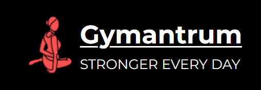
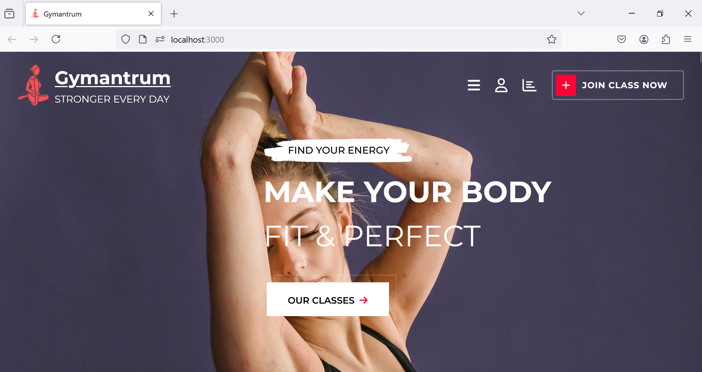
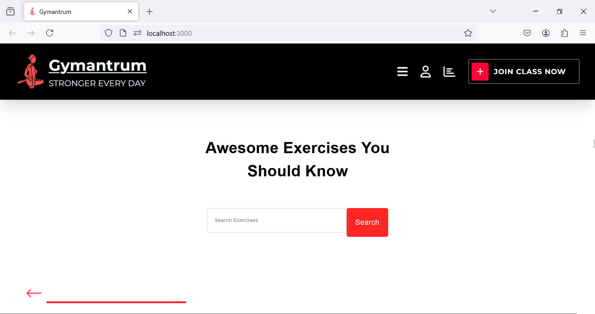
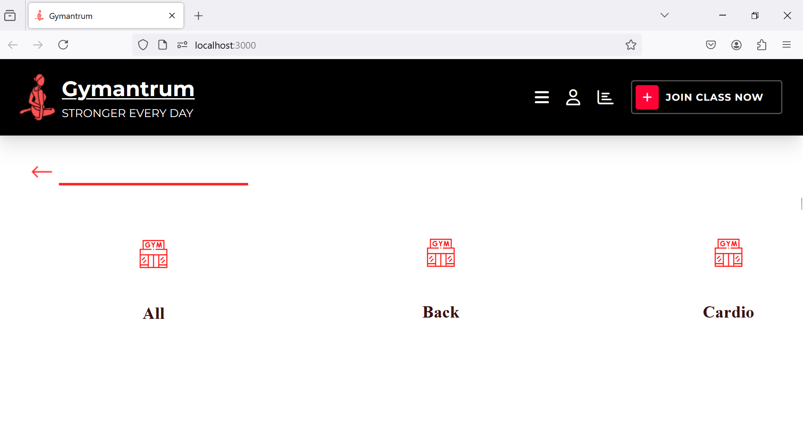
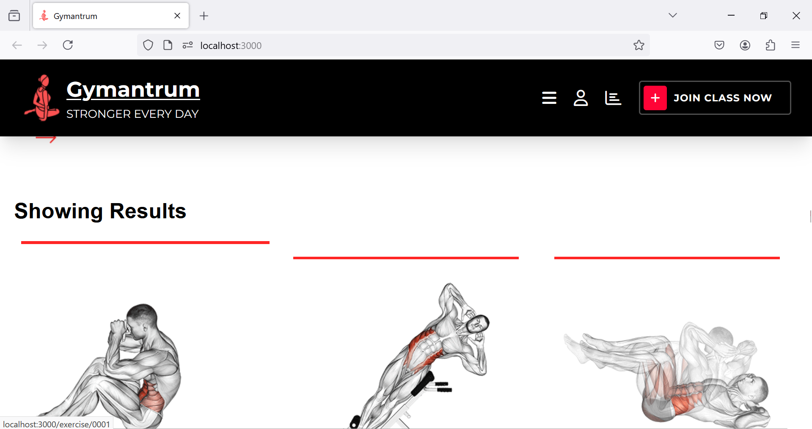
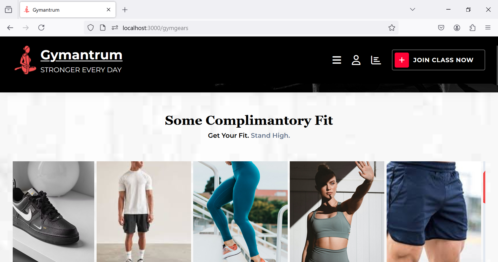
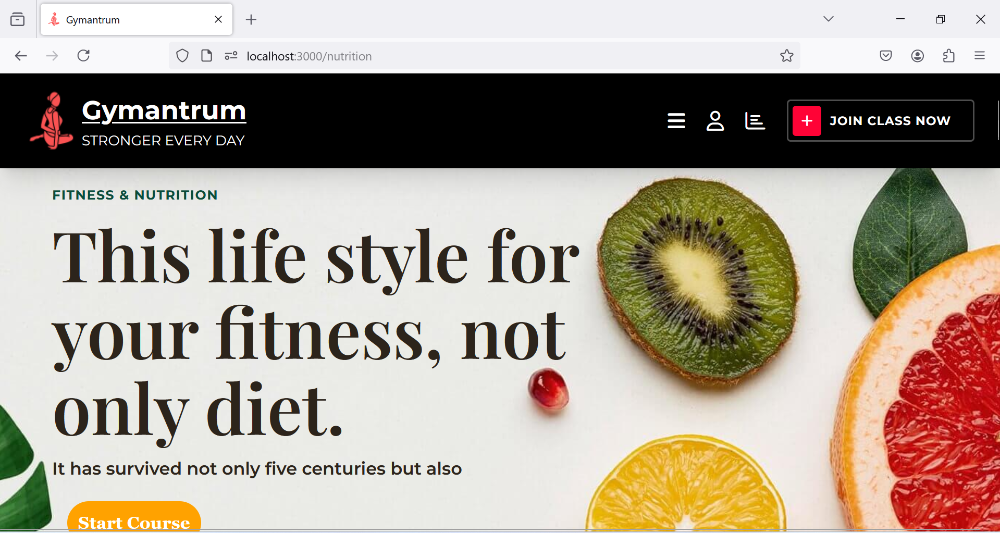
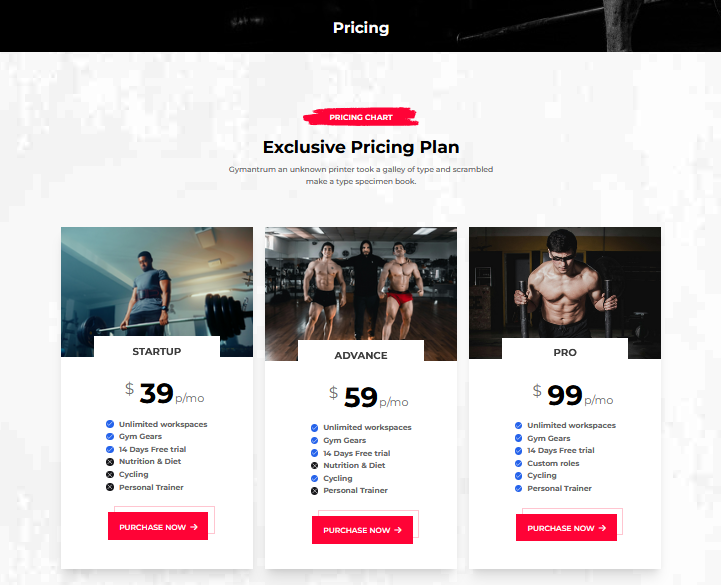
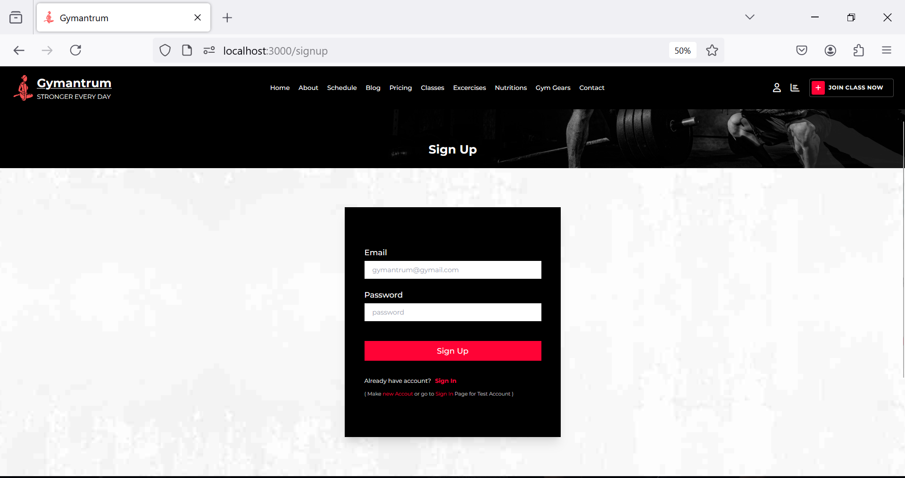
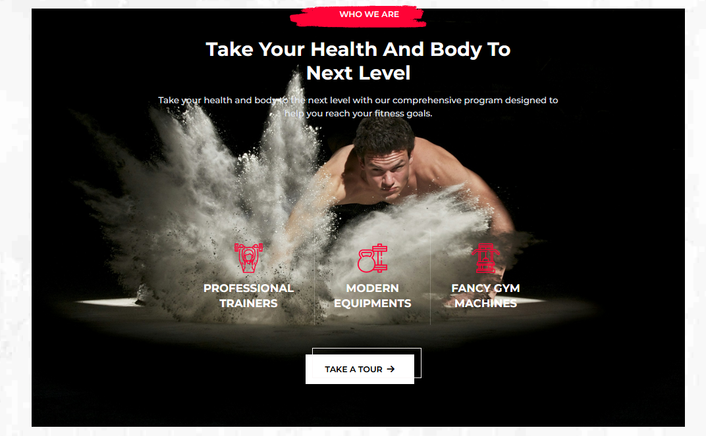

<h2>About the project</h2>

<b>Gymantrum</b> provides a space for people to improve their physical fitness and overall health through regular exercise and physical activity.

## :bookmark_tabs: Overview: - ##

This project is based on how effective exercise website will make us feel more motivated.It is based on a Exercise website wuth fully featured functions that will find exercise which user want to do with tutorials and equipment information. It also navigate user to do exercise similar to the searched one.  

## :thought_balloon: PROBLEM STATEMENT :- ##

People all over the world are fond gym and fitness. People often pay for their gym and trainer which can be afforded by some people around the world. This website show every exercise tutorial through which one can do exercise at home without a trainer.

## :dart: OBJECTIVE:- ##

The main objective of the project is to create a website using ReactJs technologies to provide great experience for the people who do their exercise at home on regular basis.

## :bulb: Feature:- ## 

## 💻 Technologies Used: ##

* **ReactJs**
* **Material CSS & UI**
* **Rapid API**
* **React Router**
* **Tailwind CSS**
* **Javascript**
* **CSS**
* **Vercel Deployment**
* **Firebase Authentication**

## Demo ##
👉Here is a working Live Demo: <a href='https://gym-website-hackathon-2024.vercel.app/'>Gymate Demo</a>

### 🚀 How to run the project : ###
1. Open the Terminal.
2. Clone the repository by entering $ git clone https://github.com/chanchal430/Gym_Website_Hackathon_2024.git .
3. Ensure that NodeJS and npm are installed on the system.
4. change the diectory to repository name using $ cd https://github.com/chanchal430/Gym_Website_Hackathon_2024.git.
5. Install the dependencies by executing the follwing command: $ npm install.
6. To run the React project. execute $npm start. and it will point to the localhost server with the port 3000.
7. Enter the IP Address: http://localhost:3000 on a web browser and use the application.

####  Dependencies: ####
The following dependencies can be found in package.json:

Api Used:https://rapidapi.com/hub
* Youtube Search and Download (https://rapidapi.com/h0p3rwe/api/youtube-search-and-download)
* ExerciseDB (https://rapidapi.com/justin-WFnsXH_t6/api/exercisedb)

Made with ♥ for gym freak

### Screenshots of the Project 📸 : ###
 
<h3 align='center'>Home Page 🏡</h3>

  
<h3 align='center'>Exercises Page 👇</h3>

 
 
<h3 align='center'>Exercises Page 👇</h3>

 
 
<h3 align='center'>Exercises Page 👇</h3>

 
 
<h3 align='center'>Gym Gear Page 👇</h3>

 
 
<h3 align='center'>Nutritions Page 👇</h3>

 
 
<h3 align='center'>Pricing Page 👇</h3>

 
 
<h3 align='center'>Login Page 👇</h3>

 
 
<h3 align='center'>About Page 👇</h3>

 
 
